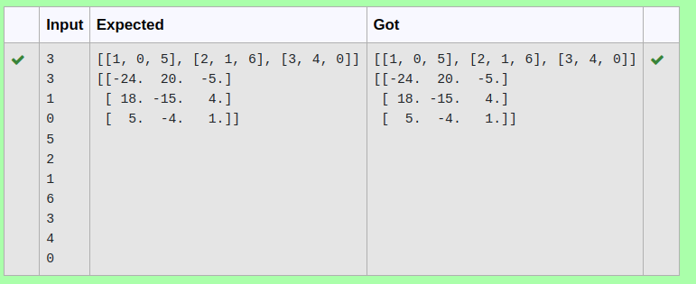

# Inverse-of-matrix

## AIM:
To write a python program to find the inverse of a matrix.

## ALGORITHM:
Step 1:
import numpy as np.

Step 2:
Enter the input.

Step 3:
Use for loop and range.

Step 4:
Use np.linalg.inv() to find inver of a matrix

Step 5:
print()


## PROGRAM:

Developed by:sarvesh.s

RegisterNumber: 22003029
```
import numpy as np
l1,l2=[],[]
n1,n2=int(input()),int(input())
for i in range(n1):
    for j in range(n2):
        values=int(input())
        l1.append(values)
    l2.append(l1)
    l1=[]
print(l2)
a=np.linalg.inv(l2)
print(a)
```

## OUTPUT:


## RESULT:
Thus the above program is executed sucessfully...
